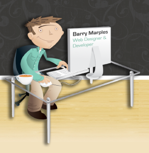
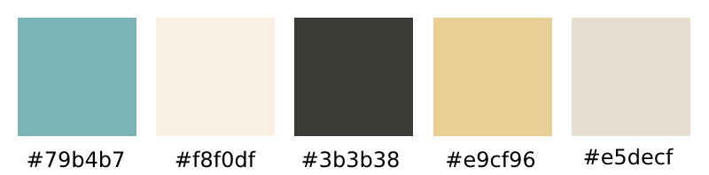
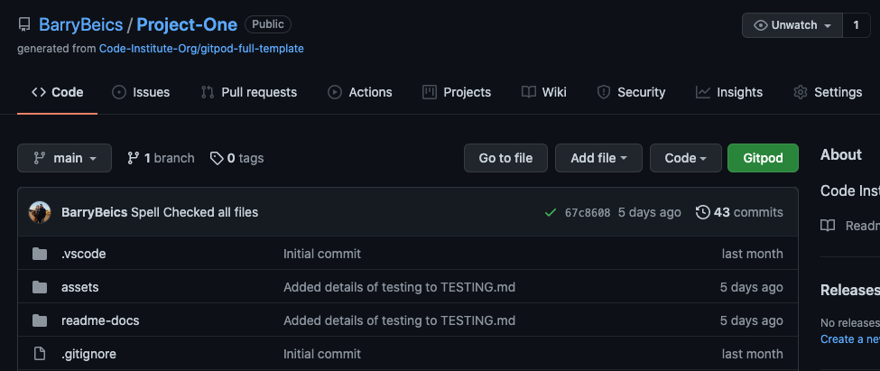
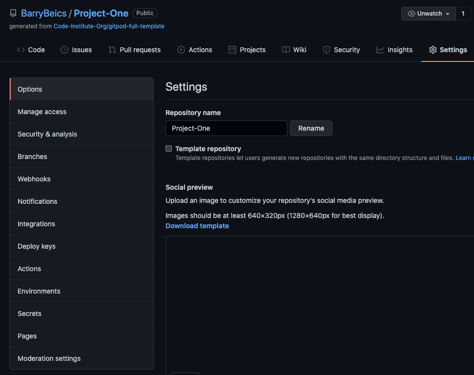
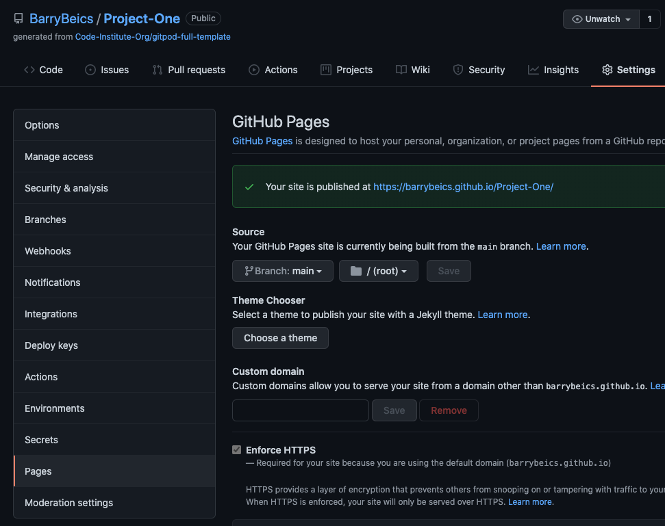
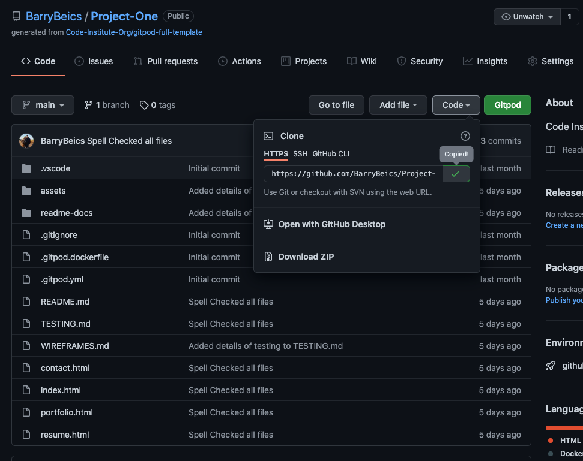
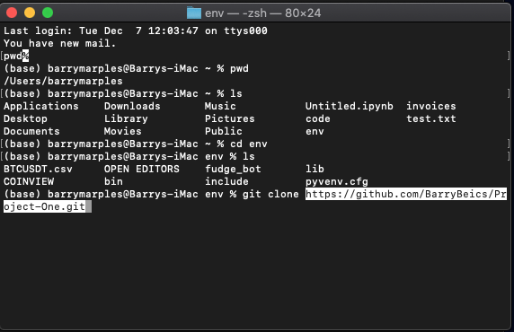

# Barry Marples Personal Website
 

 
 
This is the personal web development site for Barry Marples. As a junior developer this site will serve as a space to showcase work so that prospective employers and collaborators alike can see if Barry is right for their next big project.
 
You can visit the deployed website [here](https://barrybeics.github.io/Project-One/).
 
  
 
## 1. UX
---
 
### 1.1. Project Goals ###
 
This website has been designed for myself, so that I can build an online presence. The ultimate aim of this would be to get paid work by either personal clients or be contacted by recruiters which would be achieved by using the contact form.
 
### 1.2. User Stories ###
 
- As an owner, I want to showcase skills I have and give examples of previous work to attract more clients.
- As an owner, I want the possibility for prospective clients and recruiters to contact me easily.
- As a user, I want to be able to get in touch with the developer for any reason.
- As a user, I want to be able to view skills and examples of past work.
- As a user, I want to be able to see the developers social media presence.
- As a recuiter, I want to easily get a copy of the developers CV.
- As a curious user, I want to know more about the developer in terms of career history.
- As a potential client with specific project goals I want to easily communicate my project.
 
 
### 1.3. Design ###
 
- **Colour Scheme**: The colours have been selected to compliment the original graphic which features on every page of the site.
 
<h2 align="center"></h2>
 
- Kingfisher Turquoise #79b4b7 - This forms the colour of the navigation section, sitewide background, h2 & h3 tags
- Home Plate #f8f0df - This is used as the background of the section area, nav & socials icons
- Black Olive #3b3b38 - This used for the footer, text and the selected nav icons
- Golden West #e9cf96 - This is used in the footer text
- Litewood #e5decf - This is used for a contrast panels
 
- **Typography**: The Montserrat font is the main font used throughout the whole website with Sans Serif as the fallback font in case for any reason the font isn't being imported into the site correctly. Montserrat is a clean font used frequently in programming, so it is both attractive and appropriate.
 
- **Imagery**: This simple clean site design only contains one graphic of a character of Barry busy working at his desk. This graphic is overlaid with 2 animated gifs.
of a fresh steaming cup of coffee 
The talking mouth and blinking eyes of the character.
 
### 1.4. Wireframes ###
 
The wireframes for this site were produced in Balsamiq (https://balsamiq.com/). Wire frames were created for Desktop, Tablet & mobile respectively.
you will see the final site changed due to the concept not working well as expected in reality.
  
This required some reconfiguration of the layout using the bootstrap elements.
  
Wireframe - [View](WIREFRAMES.md)
 
  
 
## 2. Features
---
 
### 2.1. Existing features ###
 
**The Header** includes:
 
- **Developers name**: allows users to know where they are every moment.
- **Navigation Bar**: allows users to navigate the site in an easy and intuitive way.
 
**The Footer** includes:
 
- **Social**: allows users to know more about the developer. These are all links to real accounts as I intend to publish the site for my own personal use.
- **PDF Download**: allows users to download a copy of the developer CV as a pdf file.
 
Both the Header and the Footer are consistent throughout the website.
 
**Home Page** includes:
 
- **Who What Why**: three sentences that allow users to quickly get an overview of the developer.
Animated graphic showing the developer hard at work, this will disappear on smaller screens.
 
 
**Resume Page** includes:
 
- **Tools I Use**: a description of the developers perpetual development
- **Skills logos**: a simple illustration so users can see which skills held by the developer (this is for illustration purposes only as many of the skills are not held)
- **Work History**: a timeline of the positions held so the users can quickly understand the developer's past career.
 
**Portfolio Page** includes:
 
- **Description of each project**: allows the users to quickly understand the scope of the project.
- **Example layouts Graphic**: illustrates simply how the site has been built to work for all devices.
- **Live Project Link**: users can explore the project further in a separate browser window.
- **How it was made**: details of technologies used for each project.
 
**Contact Page** includes:
 
- **Personal info**: allows users to post documents, phone and email files to the developer if necessary.
- **Contact form**: allows users to make initial contact in a structured format so that the developer can respond with an answer and not need to ask for more details.
 
**Favicon**: allows the user to identify the site by just seeing the icon on the tab.
 
### 2.2. Features left to implement in the future ###
 
- The form should submit the details and send a confirmation email.
- Add a section with testimonials.
- Add future completed projects to the portfolio page.
- Add skill logos to the resume page as they are acquired during the course.
 
  
 
## 3. Technologies used
---
 
### 3.1. Languages Used ###
 
-   [HTML5](https://en.wikipedia.org/wiki/HTML5)
-   [CSS3](https://en.wikipedia.org/wiki/Cascading_Style_Sheets)
 
### 3.2. Frameworks, Libraries & Programs Used ###
 
- [Bootstrap 4.4.1:](https://getbootstrap.com/docs/4.4/getting-started/introduction/) - Bootstrap was used to handle the responsive layout of the website.
- [Hover.css:](https://ianlunn.github.io/Hover/) - Hover.css was used on the navigation buttons with the underline-from-center effect and the Social Media icons in the footer pop was used for a response while being hovered over.
- [Google Fonts:](https://fonts.google.com/) - Google fonts were used to import the 'Montserrat' font into the style.css file which is used on all pages throughout the project.
- [Font Awesome:](https://fontawesome.com/) - Font Awesome was used on the navigation buttons and in the footer which are present on all pages throughout the website to add icons for aesthetic and UX purposes.
- [Gitpod](https://gitpod.io/) - Git was used for version control by utilizing the Gitpod terminal to commit to Git and Push to GitHub.
- [GitHub:](https://github.com/) - GitHub is used to store the project's code after being pushed from Git.
- [Photoshop:](https://www.adobe.com/ie/products/photoshop.html) - Photoshop was used to resize graphics and technology logos gathered from the internet, also the portfolio mockup examples.
- [Illustrator:](https://www.adobe.com/ie/products/illustrator.html) - Illustrator was used to animate the steam on the coffee and the talking head gifs.
- [Balsamiq:](https://balsamiq.com/) - Balsamiq was used to create the [wireframes](https://github.com/) during the design process.
 
 
  
 
## 4. Testing
---
 
The testing process can be seen [here](TESTING.md).
 
  
 
## 5. Deployment
---
 
**To deploy the project**
 
This project is hosted in GitHub Pages
 
1. Once your viewing the project’s repository on GitHub select **Settings** from just above the green Gitpod button.

2. From the left hand side navigation go down and click on **Pages** link.

3. Inside that section, click on the drop-down menu under **Source** and select **Branch: Main**.
4. Click **Save** and the website is now deployed.

5. The link to the webpage appears in the green box above where you clicked **Save**.
 
Only one branch has been used for this project.

  

**To run the project locally**
 
To clone this project from GitHub:
 
1. Once you navigate the main page of project’s repository on GitHub, above the list of files click **Code**
2. This opens a view showing the url for the project click the copy icon to get the full repository address.

3. Open Terminal and ensure to navigate to the folder where you want to place the cloned project.

4. Type **git clone** and now paste the url you copied earlier.
5. Now press **Enter** to create your local clone of this project
 
 
  
 
## 6. Credits
---
 
### 6.1. Content
Most of the text in this site was made up by myself for this project. ???
 
[Bootstrap4](https://getbootstrap.com/docs/4.4/getting-started/introduction/): Bootstrap Library used throughout the project mainly to make the site responsive using the Bootstrap Grid System.
 
[MDN Web Docs](https://developer.mozilla.org/) : For Pattern Validation code. Code was modified to better fit my needs and to match an Irish phone number layout to ensure correct validation. Tutorial Found [Here](https://developer.mozilla.org/en-US/docs/Web/HTML/Element/input/tel#Pattern_validation)
 
### 6.2. Media
 
All Images were created by the developer.
 
### 6.3. Acknowledgments
 
[Precious Ijege](https://www.linkedin.com/in/precious-ijege-908a00168/?originalSubdomain=ng) for the mentor guidance and support.
 
The [Code Institute](https://codeinstitute.net/) tutor team.
 
 
 

