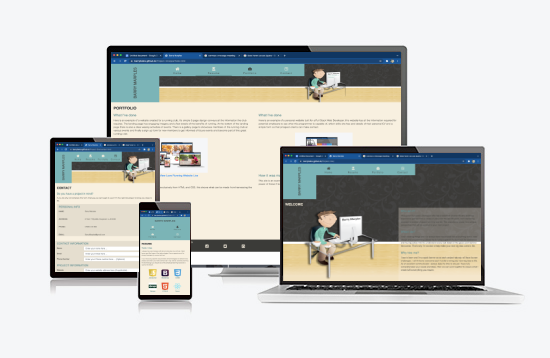

https://www.fabiofranchino.com/blog/vertical-text-with-css/

<h1 align="center">Barry Marples Personal Website</h1>

[View the live project here.](https://barrybeics.github.io/Project-One/)

This website is the personal web development site for Barry Marples. As a junior developer this site will serve as a space to showcase work so that prospective employers and collaborators can see if Barry is the man for there next big project and then they can make contact.

<h2 align="center"></h2>

## User Experience (UX)mkdir

-   ### User stories

    -   #### First Time Visitor Goals

        1. As a First Time Visitor, I want to instantly understand what the site is about and if it's relevant to me.
        2. As a First Time Visitor, I want the navigation to be intuitive and simple to use.
        3. As a First Time Visitor, I want to be able to quickly and easily gage if this person has the skills I require for my next project and that the site conveys an attitude that inspires me enough confidence so as to not hesitate to make contact.
	

    -   #### Returning Visitor Goals

        1. As a Returning Visitor, I want to find information about coding challenges.
        2. As a Returning Visitor, I want to find the best way to get in contact with the organisation with any questions I may have.
        3. As a Returning Visitor, I want to find community links.

    -   #### Frequent User Goals
        1. As a Frequent User, I want to check to see if there are any newly added challenges or hackathons.
        2. As a Frequent User, I want to check to see if there are any new blog posts.
        3. As a Frequent User, I want to sign up to the Newsletter so that I am emailed any major updates and/or changes to the website or organisation.

-   ### Design
    -   #### Colour Scheme
        -   The three main colours are teal, dark grey & cream. These have been selected to compliment the original graphic which features on every page of the site. 
    -   #### Typography
        -   The Montserrat font is the main font used throughout the whole website with Sans Serif as the fallback font in case for any reason the font isn't being imported into the site correctly. Montserrat is a clean font used frequently in programming, so it is both attractive and appropriate.
    -   #### Imagery
        -   This simple clean site design only contains one images of a character of Barry busy working at his desk. This imaged is overlaid with 2 animated gifs. 
of a fresh steaming cup of coffee and 2. The talking mouth and blinking eyes of the character.
*   ### Wireframes

    -   Home Page Wireframe - [View](./readme-docs/wireframe-desktop-index.png)

    -   Mobile Wireframe - [View](https://github.com/)

    -   Contact Us Page Wireframe - [View](https://github.com/)

## Features

-   Responsive on all device sizes

-   Contact Form

-   Animated gifs to and some interest to the simple clean design

## Technologies Used

### Languages Used

-   [HTML5](https://en.wikipedia.org/wiki/HTML5)
-   [CSS3](https://en.wikipedia.org/wiki/Cascading_Style_Sheets)

### Frameworks, Libraries & Programs Used

1. [Bootstrap 4.4.1:](https://getbootstrap.com/docs/4.4/getting-started/introduction/)
    - Bootstrap was used to handle the responsive layout of the website.
1. [Hover.css:](https://ianlunn.github.io/Hover/)
    - Hover.css was used on the navigation buttons with the underline-from-center effect and the Social Media icons in the footer pop was used for a response while being hovered over.
1. [Google Fonts:](https://fonts.google.com/)
    - Google fonts were used to import the 'Montserrat' font into the style.css file which is used on all pages throughout the project.
1. [Font Awesome:](https://fontawesome.com/)
    - Font Awesome was used on the navigation buttons and in the footer which are present on all pages throughout the website to add icons for aesthetic and UX purposes.
1. [Gitpod](https://gitpod.io/)
    - Git was used for version control by utilizing the Gitpod terminal to commit to Git and Push to GitHub.
1. [GitHub:](https://github.com/)
    - GitHub is used to store the projects code after being pushed from Git.
1. [Photoshop:](https://www.adobe.com/ie/products/photoshop.html)
    - Photoshop was used to resize graphics and technology logos gathered from the internet, also the portfolio mockup examples.
1. [Illustrator:](https://www.adobe.com/ie/products/illustrator.html)
    - Illustrator was used to animate the steam on the coffee and the talking head gifs.
1. [Balsamiq:](https://balsamiq.com/)
    - Balsamiq was used to create the [wireframes](https://github.com/) during the design process.
