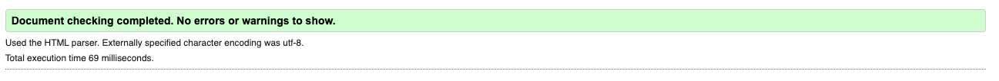
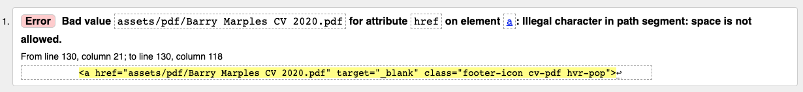
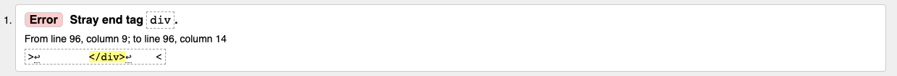
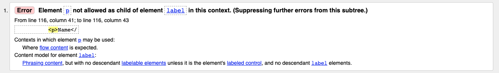
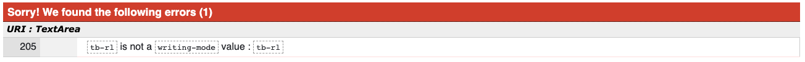
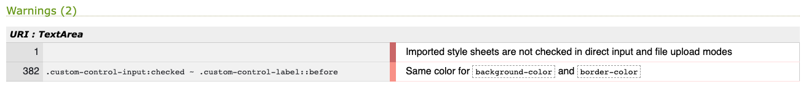

# Testing
## Code Validation
The site has been thoroughly tested. All the code has been run through the [W3C html Validator](https://validator.w3.org/) and the [W3C CSS Validator](https://jigsaw.w3.org/css-validator/).
Then the success graphic was displayed for all pages of the site.

  
Website CSS validation
NOT VALIDATED YET
  

# Responsiveness Test
* The responsive design tests were carried out manually whilst building the site with [Google Chrome DevTools](https://developer.chrome.com/docs/devtools/) and post build with [Responsive Design Checker](https://www.responsivedesignchecker.com/).

 

## Mobiles
|        | iPhone 5 | iPhone 6/7 Plus | Galaxy S5/S6/S7 | Xperia Z3/Z3 | Google Pixel | Nexus 4 | Nexus 5/6 |
|--------|----------|-----------------|-----------------|--------------|--------------|---------|-----------|
| Render |  fail    |  pass           |  fail           |  fail        |  fail        |  fail   |  fail     |
| Images |  fail    |  pass           |  fail           |  fail        |  pass        |  fail   |  pass     |
| Links  |  pass    |  pass           |  pass           |  pass        |  pass        |  pass   |  pass     |
 
 
## Tablets
|        | iPad Mini | iPad Pro | Kindle Fire | Nexus 7 | Nexus 9 | Galaxy Tab 10 |
|--------|-----------|----------|-------------|---------|---------|---------------|
| Render |  fail     |  pass    |  fail       |  fail   |  fail   |  pass         |
| Images |  pass     |  pass    |  pass       |  pass   |  pass   |  pass         |
| Links  |  pass     |  pass    |  pass       |  pass   |  pass   |  pass         |
 
 
## Desktops
|        | 13" Desktop | 15" Desktop | 19" Desktop | 20" Desktop | 22" Desktop | 23" Desktop |
|--------|-------------|-------------|-------------|-------------|-------------|-------------|
| Render |  pass       |  pass       |  pass       |  pass       |  pass       |  fail       |
| Images |  pass       |  pass       |  pass       |  pass       |  pass       |  pass       |
| Links  |  pass       |  pass       |  pass       |  pass       |  pass       |  pass       |
 
 
## Browser Compatibility
This site was tested on the following browsers with no visible issues for the user. Google Chrome, Safari and Mozilla Firefox. Appearance, functionality and responsiveness were consistent throughout for a range of device sizes and browsers.

 ### Testing User Stories from User Experience (UX) Section
- #### First Time Visitor Goals
  1. As a First Time Visitor, I want to instantly understand what the site is about and if it's relevant to me.
      - The landing page graphic shows a man busy working away and the supporting text clarifies what the site is about.
     
    
  2. As a First Time Visitor, I want the navigation to be intuitive and simple to use.
 
      - The user can then gain further information simply by choosing the resume or portfolio links from the navigation bar.
      - Nowhere on the site will the user get trapped down a deadend and by required to use the browser back button as there are clear navigation options at the top of every page.
    
  3. As a First Time Visitor, I want to be able to quickly and easily gage if this person has the skills I require for my next project and that the site conveys an attitude that inspires confidence and competence.
      - The user will see logos of the technologies used for simple comprehension that the developer has the relevant skills.
      - The portfolio page showcases work so as to inspire confidence and competence in the developers abilities.

- #### Returning Visitor Goals
  1. As a Returning Visitor, I want to find the best way to get in contact with the organisation with any questions I may have.
      1. The navigation bar has the "Contact" Page.
      2. This gives the user the opportunity to complete the form and make contact
      3. In the footer of the site the a social media link for further information

 - #### Frequent User Goals
 
 NEEDS FINISHING
 
 
 
 
 

### Further Testing
-   Friends and family members were asked to review the site and documentation to point out any bugs and/or user experience issues.
  
 
### Known Bugs
-   Detailed below are the errors found and actions taken to resolve them.

### Home page

Fixed: Illegal character in path in pdf document
Fixed: Correct file path added to footer for pdf file
  

### Portfolio page

Fixed: removed stay end tag from line 96 of portfolio.html
  

### Contact page

Fixed: invalid use of a p tag inside a form label removed
  

### Website CSS validation

Warning 1, imported google fonts, Fixed by removing as my final choice of font Montserrat
Warning 2, Fixed by applying a slightly darker color to border
  

# Responsiveness Test
 
Note: Currently on wide displays the site begins to look sparse, therefore the site should maybe have a max width set in order to hold a neat structure for the site across all devices.
 
## Mobiles
 
iPhone5 :   Render fail, Text on form spills of the screen
          Image fail, Portfolio images are too wide for the screen

Galaxy S5/S6/S7 & Xperia Z3/Z3 :   Render fail, Text on form spills of the form box
                                 Image fail, Portfolio images are too wide for the screen  

Google Pixel & Nexus 5/6 :   Render fail, Text on one option stacks and doesn't display well  

Nexus 4 :   Render fail, Text on one option stacks and doesn't display well
          Image fail, Portfolio images are too wide for the screen
 
## Tablets
 
iPad Mini & Kindle Fire :   Render fail, work history text overlaps and displays poorly
                                     
Nexus 7 & Nexus 9:   Render fail, Link text on portfolio page displays awkwardly
                   Render fail, Tiny gap appears around home nav button
 
## Desktop
 
23" Desktop :   Render fail, for this size and above the content begins to loop a bit sparse

