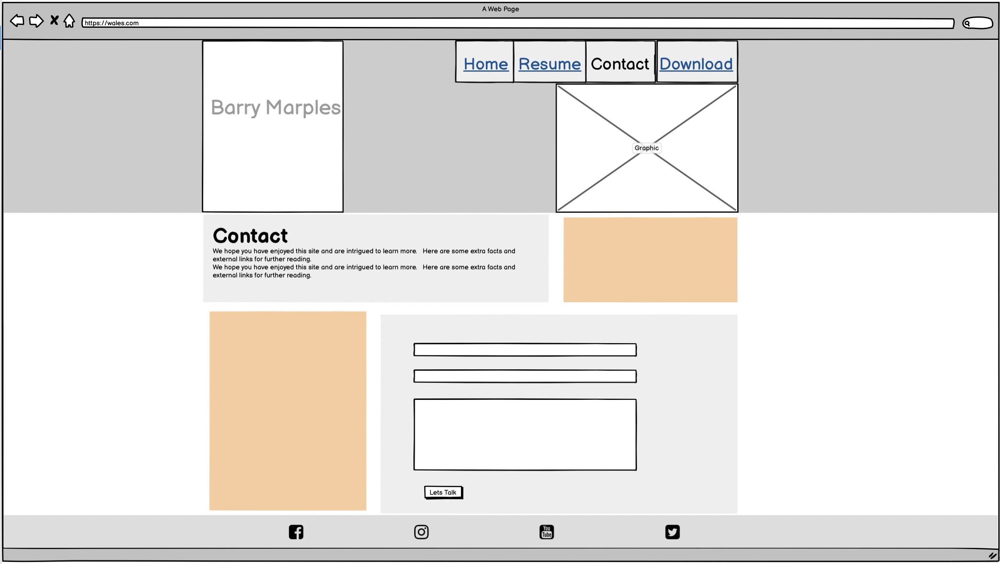
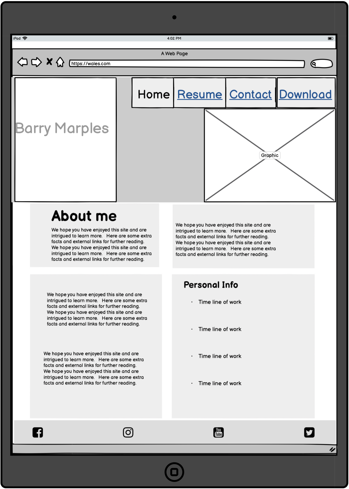
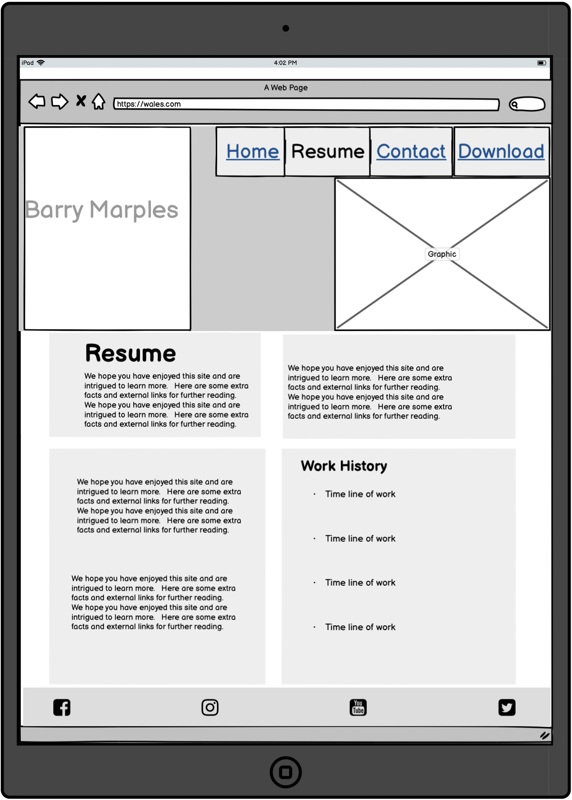
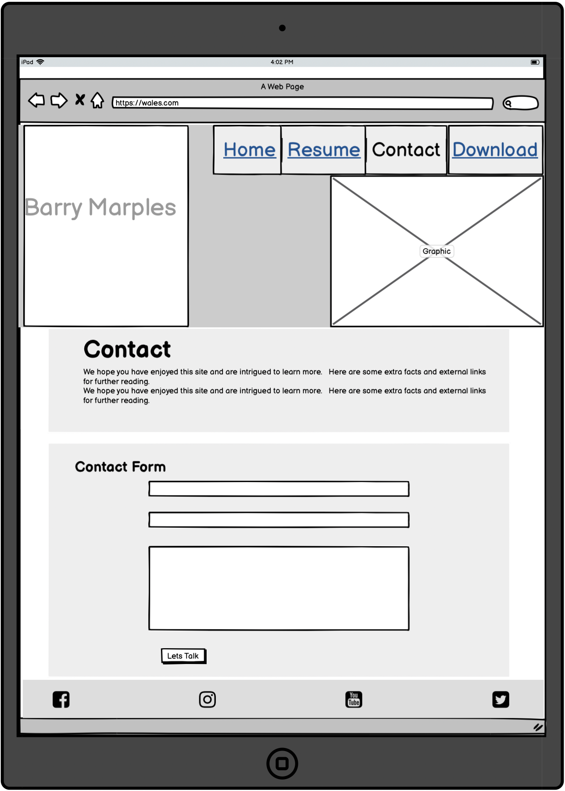
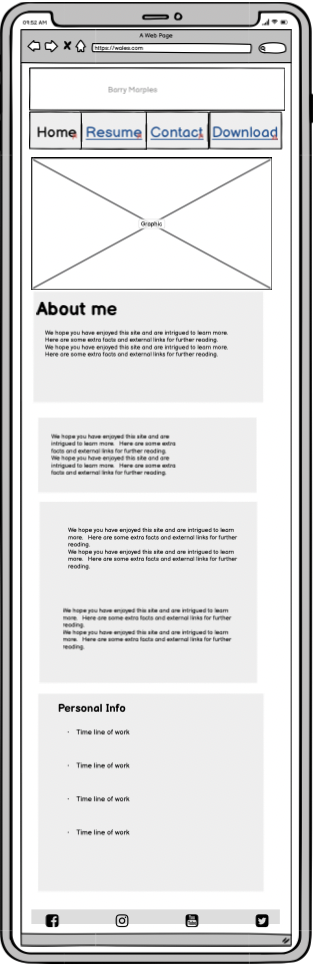
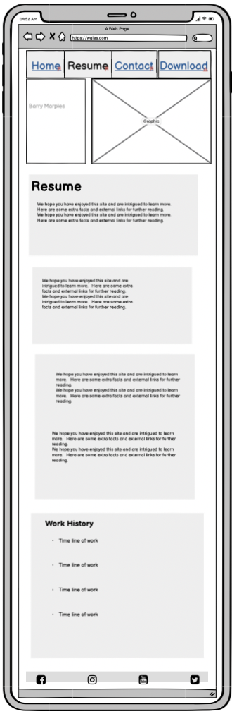
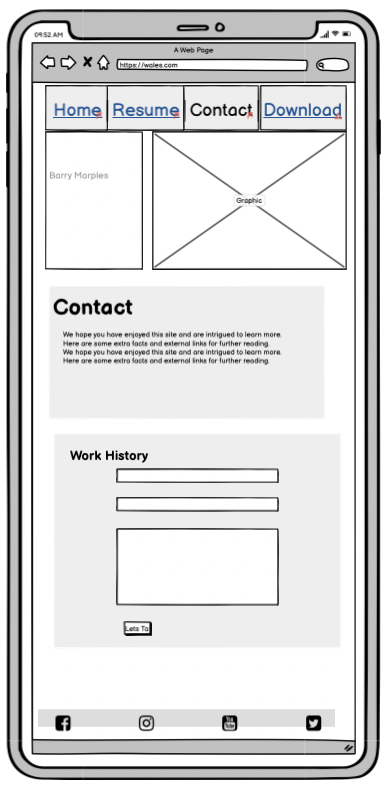

<h1 align="center">Wireframes</h1>

  

The wireframes for this site were produced in Balsamiq (https://balsamiq.com/).
 
Wire frames were created for Desktop, Tablet & mobile respectively.
 
As you can see the final site changed due to the concept not working well in reality.
 
This required some reconfiguration of the layout using the bootstrap elements.

 

## Desktop

-   Responsive on all device sizes

<h2 align="center">

</h2>

 

Back to README - [View](README.md)

 

## Tablet

-   Responsive on all device sizes

 

<h2 align="center">

</h2>

 

Back to README - [View](README.md)

 

## Mobile

-   Responsive on all device sizes

 

<h2 align="center">

</h2>

 

Back to README - [View](README.md)